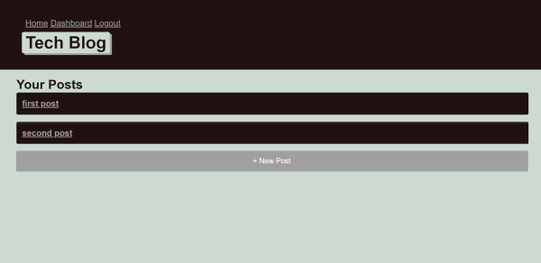

  
  
# Tech Blog

## Description

Create, save, view, and delete notes with the Noted application. Organize and note important tasks and informationn so you don't forget.

**Table of Contents**

  * [Deployed Application](#website)
  * [Usage](#usage)
  * [Website](#website)
  * [Contributing](#contributing)
  * [License](#license)
  * [Credits](#credits)
  * [Questions](#questions)

## Website

[Noted](https://stormy-ravine-87920.herokuapp.com)

## Usage

 - visit website url

    

 - click one of the links to view a post

    

 - login or sign up to make posts and comment

    

 - view and edit your posts from the dashboard

    

 - click logout to end your session
    
    

## Website

Visit the deployed [here]()

## Contributing

All contributions are subject to review.

## License
  
This application is licensed under [ISC](https://opensource.org/licenses/ISC).

## Credits
  
Code customized from [anthonypena97](https://github.com/anthonypena97/note-taker)

## Questions

Github: [RochelleYounger](https://github.com/RochelleYounger)

Contact Me: [regnuoy321@gmail.com](mailto:regnuoy321@gmail.com)

---
© 2022 RochelleYounger
